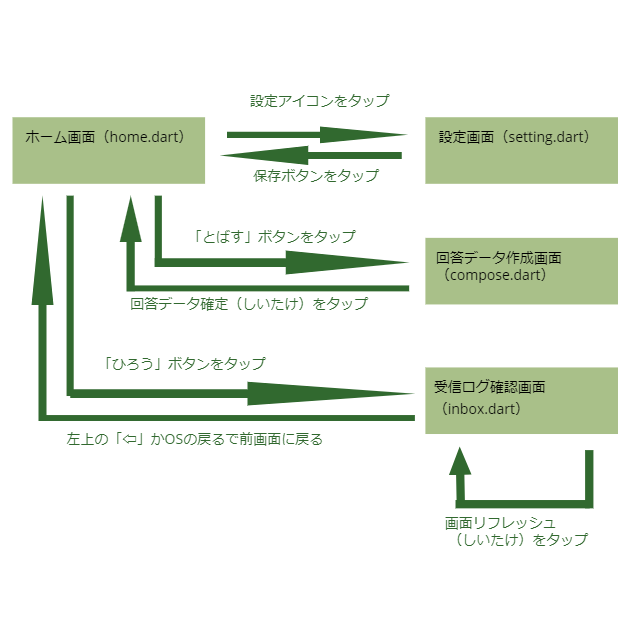
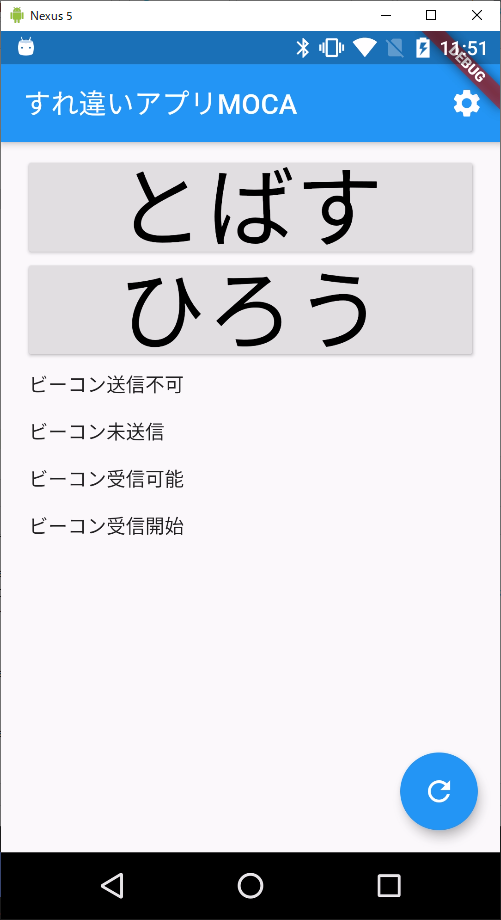
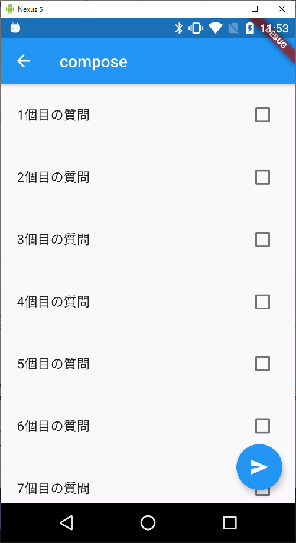
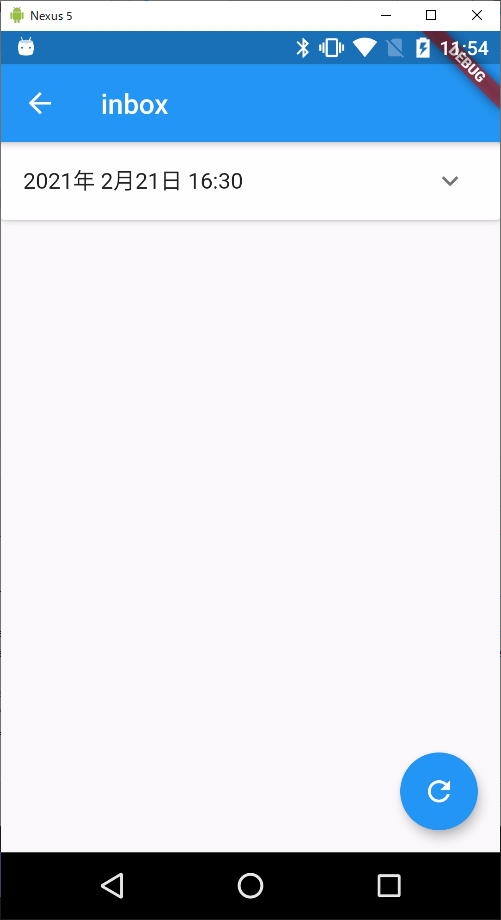
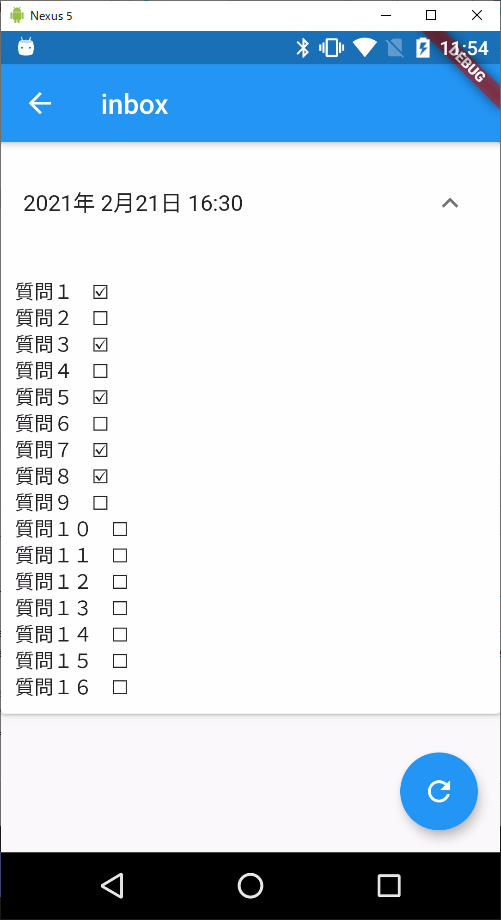

## 各画面の関係

## 各画面のスクリーンショットと説明

### ホーム画面

ホーム画面は各メニューのボタンとビーコンの送受信状況を表示する

#### ビーコン送信可能・ビーコン送信不可
ハードウェアがビーコンの送信に対応しているかチェックした結果。対応していない場合は回答データ作成後もビーコン送信はできない

#### ビーコン送信開始・ビーコン未送信
ビーコンを現在送信しているかどうか。回答データ未作成の場合はビーコン送信を行わない

#### ビーコン受信可能・ビーコン受信不可
ハードウェアがビーコンの受信に対応しているかチェックした結果。受信不可と出た場合はアプリは動作しない

#### ビーコン受信開始・ビーコン未受信
ビーコンの受信処理が開始しているかどうか。待ち受けを開始しているかどうかを表示しているだけで実際に受診しているかどうかではない。

#### スクリーンショット

### 回答データ作成画面

| 通常時 | 選択時 |
| ---- | ---- |
|  |   |

### 受診ログ表示画面

| 通常時 | 展開時 |
| ---- | ---- |
|  |   |
